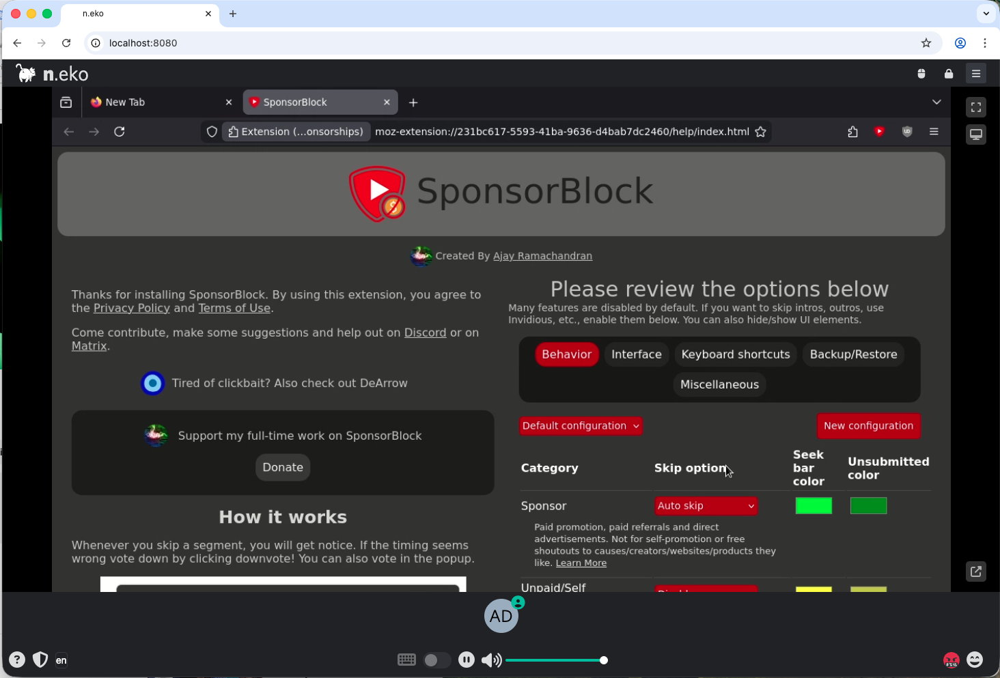

# 2026. 03. 10. - Getting started

# Envoy starters
Trying out the Envoy gateway api

## Quickstart guide

After installing helm, I went through the Envoy gateway's [quickstart](https://gateway.envoyproxy.io/docs/tasks/quickstart/) guide:

### Installing
```
helm install eg oci://docker.io/envoyproxy/gateway-helm --version v1.7.0 -n envoy-gateway-system --create-namespace
```

### Checking if the gateway is available:
```
kubectl wait --timeout=5m -n envoy-gateway-system deployment/envoy-gateway --for=condition=Available
```

### Getting the example config file

Instead of applying the configurations as it is in the guide, I downloaded it using wget, this way I could look into the file itself, and base my later configurations on it.
```
wget https://github.com/envoyproxy/gateway/releases/download/v1.7.0/quickstart.yaml
```

### Trying out the quickstart example

Since I'm not using an external LoadBalancer for this, I had to use the port forward method

Getting the name of the Envoy service
```
export ENVOY_SERVICE=$(kubectl get svc -n envoy-gateway-system --selector=gateway.envoyproxy.io/owning-gateway-namespace=default,gateway.envoyproxy.io/owning-gateway-name=eg -o jsonpath='{.items[0].metadata.name}')
```

Port forwarding
```
kubectl -n envoy-gateway-system port-forward service/${ENVOY_SERVICE} 8888:80 &
```

Testing out with curl
```
curl --verbose --header "Host: www.example.com" http://localhost:8888/get
```

## Cleaning up

```
kubectl delete -f https://github.com/envoyproxy/gateway/releases/download/v1.7.0/quickstart.yaml --ignore-not-found=true
```

```
helm uninstall eg -n envoy-gateway-system
```

# STUNner starter wit N.eko
I'm not going to go into the installation details unlike with Envoy. With STUNner, I started with the [installation guide](https://docs.l7mp.io/en/stable/INSTALL/) 

After getting STUNner, I continued with the [N.eko](https://docs.l7mp.io/en/stable/examples/neko/) guide.

As I was testing these out on a MAC system, I created a dockerfile for neko-firefox to be able to run on my architecture. The image can be found [here](https://hub.docker.com/repository/docker/drigrgly/neko-firefox/general).

The procedure to build the image went as the following:
```
git clone https://github.com/m1k1o/neko.git
cd neko/apps/firefox
```
```
docker buildx build \
  --platform linux/arm64 \
  -t drigrgly/neko-firefox:arm64 .
```

It works on chrome, but not on firefox
