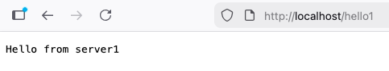
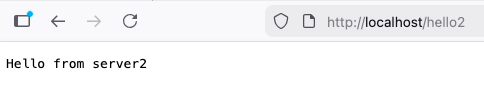
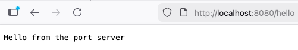

# 2026. 03. 11. - Modifying starter configs

## Simple path matching test

The following can be found in the folder [combining-udp-tcp](../combining-udp-tcp)
To test out a more custom configuration I created a simple `server.js` file, which has a `/hello` REST api endpoint.

After creating a `Dockerfile` to encapsulate this application I made a `deploy.yaml` to serve it.

I used the Envoy Gateway API to achieve the wanted results.

Taking the `http-routing.yaml` from the Envoy Gateway API tutorials as a base I created the GatewayClass, Gateway and HTTPRoute resources. The requests get sent to a specific server like this:
```
Request -> /hello1 -> replace '/hello1' with '/hello' -> server1/hello
Request -> /hello2 -> replace '/hello2' with '/hello' -> server2/hello
```



After this I tried it out with having two gateways, one listening to :80 the other one for :8080. This way, the original two servers can be reached by `IP/hello1` `IP/hello2` and the third one by using `IP:8080/hello`. For this I expanded the `deployment.yaml` with a new Gateway, and a third server with a service, which responds with `Hello from the port server`.

