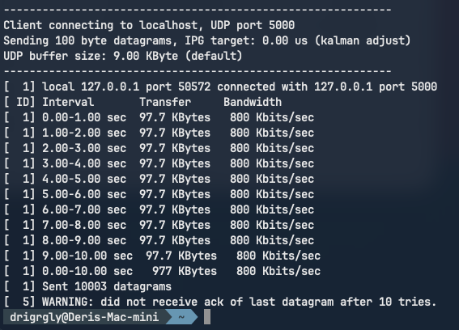

# 2026. 03. 16. - devlog

# Simple tunnel
For this project I followed [this stunner guide](https://docs.l7mp.io/en/stable/examples/simple-tunnel/)

## Getting the required stuff

### turncat

The official guide can be found [here](https://docs.l7mp.io/en/stable/cmd/turncat/)

Linux and macOS installation:
```
curl -sL https://raw.githubusercontent.com/l7mp/stunner/main/cmd/getstunner/getstunner.sh | sh -
export PATH=$HOME/.l7mp/bin:$PATH
```

Installng the `turncat` binary using Go toolchain
```
go install github.com/l7mp/stunner/cmd/turncat@latest
```

Specify OS and CPU architecture (for example for mac)
```
GOOS=macos GOARCH=arm64 go install github.com/l7mp/stunner/cmd/turncat@v0.17.5
```

### Iperf

With my package manager I installed [Iperf](https://iperf.fr/iperf-download.php)

Here are some examples for different systems

macOS: \
HomeBrew: `brew install iperf` **<- I used this one** \
MacPorts: `sudo port install iperf`

Ubuntu / Debian / Mint: \
`sudo apt-get install iperf`

Fedora Fedora / Red Hat / CentOS / Rocky: \
`yum install iperf`

Arch based:
`sudo pacman -S iperf`

### Simple-tunnel starter
To follow the guide I cloned the [stunner repository](https://github.com/l7mp/stunner) and copied the files from the `simple-tunnel` example into my [simple-tunnel folder](../simple-tunnel/).


### Stunner installation

On the steps of installing Stunner you can find more in my previous devlog: [Getting started](<2026-03-10 Getting started.md#stunner-starter-wit-neko>)

## Server configuration

First, I created the `stunner` namespace:
```
kubectl create namepsace stunner
```

I applied the two manifests in this order:
```
kubectl apply -f iperf-server.yaml
kubectl apply -f iperf-stunner.yaml
```

Next I checked if all the necessary resources got installed:
```
kubectl get gatewayconfigs,gateways,udproutes.stunner.l7mp.io -n stunner
NAME                                                  REALM             DATAPLANE   AGE
gatewayconfig.stunner.l7mp.io/stunner-gatewayconfig   stunner.l7mp.io   default     79s

NAME                                            CLASS                  ADDRESS         PROGRAMMED   AGE
gateway.gateway.networking.k8s.io/tcp-gateway   stunner-gatewayclass   192.168.139.2   True         79s
gateway.gateway.networking.k8s.io/udp-gateway   stunner-gatewayclass   192.168.139.2   True         79s

NAME                                    AGE
udproute.stunner.l7mp.io/iperf-server   79s
```

## Running the benchmark

Get the ClusterIP of the `iperf-server` service
This is going to be the peer address `turncat` will ask STUNner to relay the iperf test traffic
```
export IPERF_ADDR=$(kubectl get svc iperf-server -o jsonpath="{.spec.clusterIP}")
```

Setting up `turncat` to listen to `UDP:127.0.0.1:5000`, for the specifics you can check the [official guide](https://docs.l7mp.io/en/stable/examples/simple-tunnel/)
```
turncat --log=all:INFO udp://127.0.0.1:5000 k8s://stunner/udp-gateway:udp-listener \
     udp://$IPERF_ADDR:5001
```

Starting the benchmark
```
iperf -c localhost -p 5000 -u -i 1 -l 100 -b 800000 -t 10
```

The result:


You can check the server logs with
```
kubectl logs $(kubectl get pods -l app=iperf-server -o jsonpath='{.items[0].metadata.name}')
```

<span style="color:orange">**Problem 1**</span> \
The server logs should contain the statistics about the benchmark, but for me it is missing:

```
kubectl logs $(kubectl get pods -l app=iperf-server -o jsonpath='{.items[0].metadata.name}')
------------------------------------------------------------
Server listening on UDP port 5001 with pid 1
Read buffer size: 1470 Byte 
UDP buffer size:  224 KByte (default)
------------------------------------------------------------
```
Turncat output:
```
turncat --log=all:INFO udp://127.0.0.1:5000 k8s://stunner/udp-gateway:udp-listener \   
     udp://$IPERF_ADDR:5001
21:57:43.670504 turncat.go:193: turncat INFO: Client listening on udp://127.0.0.1:5000, TURN server: turn://192.168.139.2:3478?transport=udp, peer: udp:192.168.194.167:5001
21:57:55.483057 turncat.go:464: turncat WARNING: Cannot connect back to client udp:127.0.0.1:53865: dial udp 127.0.0.1:5000->127.0.0.1:53865: bind: address already in use
```

After having a discussion about the problem, we came to the conclusion, that it is caused by the differences of how linux and mac are handling the port/socket bindings.

<span style="color:orange">**Problem 2**</span> \
After the previous discovery, I've tried out the setup on **Linux (Manjaro)**, using minkube. Everything went well, until I got to the same point as I did on mac. Fortunately, this time I got a different error:

```
19:19:14.110477 turncat.go:472: turncat WARNING: Relay setup failed for client udp:127.0.0.1:39347: failed to allocate TURN relay transport for client udp:127.0.0.1:39347: all retransmissions failed for Few1WQLdBDcp3vVr
```
For some reason the turncat outside of the cluster wasn't able to connect to the turn server inside of the cluster.

<span style="color:lime">**Resolution**</span> \
After spending countless hours I've given up on minikube and installed a `k3s` cluster. After setting up stunner, and all the necessary dependencies to try out the `simple-tunnel` example, it finally worked:


```
iperf -c 127.0.0.1 -p 5000 -u -l 100 -b 5M -t 5
------------------------------------------------------------
Client connecting to 127.0.0.1, UDP port 5000
Sending 100 byte datagrams, IPG target: 0.00 us (kalman adjust)
UDP buffer size:  208 KByte (default)
------------------------------------------------------------
[  1] local 127.0.0.1 port 45142 connected with 127.0.0.1 port 5000
[ ID] Interval       Transfer     Bandwidth
[  1] 0.0000-5.0003 sec  3.13 MBytes  5.24 Mbits/sec
[  1] Sent 32771 datagrams
[  1] Server Report:
[ ID] Interval            Transfer     Bandwidth        Jitter   Lost/Total  Latency avg/min/max/stdev PPS  Rx/inP  Read/Timeo/Trunc  NetPwr
[  1] 0.0000-4.9975 sec  3.13 MBytes  5.25 Mbits/sec   0.013 ms 0/32770 (0%) 0.078/0.047/2.789/0.060 ms 6557 pps 6557/0(0) pkts 0/0/0 8409

```

```
kubectl logs $(kubectl get pods -l app=iperf-server -o jsonpath='{.items[0].metadata.name}')
------------------------------------------------------------
Server listening on UDP port 5001 with pid 1
Read buffer size: 1470 Byte 
UDP buffer size:  208 KByte (default)
------------------------------------------------------------
[  1] local 10.42.0.19%eth0 port 5001 connected with 10.42.0.22 port 37480 (sock=3) (peer 2.2.1-rc) on 2026-03-25 19:37:20.784 (UTC)
[ ID] Interval        Transfer     Bandwidth        Jitter   Lost/Total  Latency avg/min/max/stdev PPS Read/Timeo/Trunc NetPwr
[  1] 0.00-5.00 sec  3.13 MBytes  5.25 Mbits/sec   0.013 ms 0/32770 (0%) 0.078/0.047/2.789/0.060 ms 6557 pps 32771/0/0 8409

```