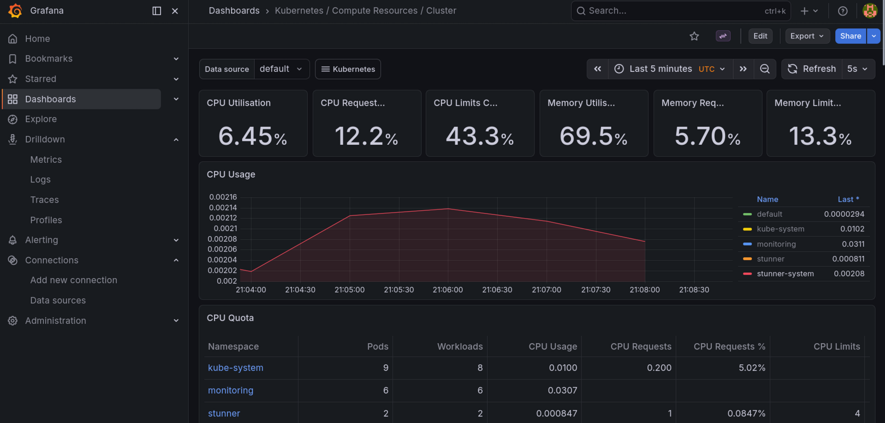
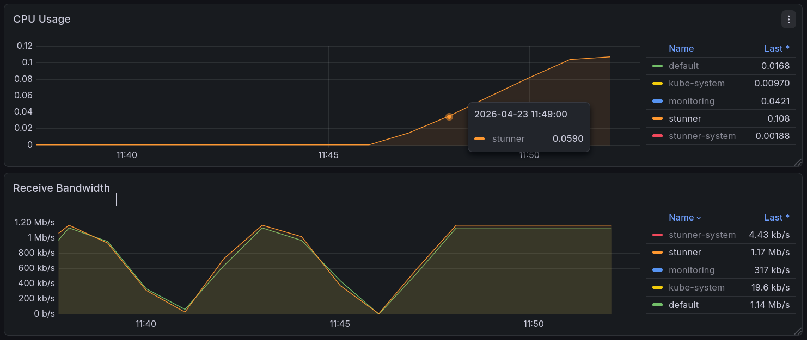

# 2026. 04. 22. - Monitoring, Prometheus and Grafana

In order to get different metrics I am utilizing the prometheus metric pack.

To install this firstly, we have to have `helm` installed

After this requirement is met, the rest of the process is pretty easy:

1. Add the helm repository
```bash
helm repo add prometheus-community https://prometheus-community.github.io/helm-charts
```

2. Update the repo
```bash
helm repo update
```

3. Create a namespace for the monitoring utilities
```bash
kubectl create namespace monitoring
```

4. Create the resources with `helm install`
```bash
helm install monitoring prometheus-community/kube-prometheus-stack --namespace monitoring
```

We should see the following output:
```bash
NAME: monitoring
LAST DEPLOYED: Wed Apr 22 22:40:18 2026
NAMESPACE: monitoring
STATUS: deployed
REVISION: 1
DESCRIPTION: Install complete
TEST SUITE: None
NOTES:
kube-prometheus-stack has been installed. Check its status by running:
  kubectl --namespace monitoring get pods -l "release=monitoring"

Get Grafana 'admin' user password by running:

  kubectl --namespace monitoring get secrets monitoring-grafana -o jsonpath="{.data.admin-password}" | base64 -d ; echo

Access Grafana local instance:

  export POD_NAME=$(kubectl --namespace monitoring get pod -l "app.kubernetes.io/name=grafana,app.kubernetes.io/instance=monitoring" -oname)
  kubectl --namespace monitoring port-forward $POD_NAME 3000

Get your grafana admin user password by running:

  kubectl get secret --namespace monitoring -l app.kubernetes.io/component=admin-secret -o jsonpath="{.items[0].data.admin-password}" | base64 --decode ; echo


Visit https://github.com/prometheus-operator/kube-prometheus for instructions on how to create & configure Alertmanager and Prometheus instances using the Operator.
```

To reach the Grafana dashboard we can use port forwarding to expose the service:
```bash
kubectl port-forward svc/monitoring-grafana -n monitoring 3030:80 
```
This will allow us to reach it through `localhost:3030`

To enter, we have to get the password first:
```bash
kubectl get secret monitoring-grafana -n monitoring -o jsonpath="{.data.admin-password}" | base64 -d

<HERE IS THE PASSWORD OUTPUT>
```

username: `admin`
password: `<The output password>`


On the `Grafana dashboard` under `Dashboards > Kubernetes / Compute Resources / Cluster` we can see the resource usage of our cluster


# Difference between offload and non-offload

Again, using the simple-tunnel example, I've generated some traffic with `iperf`. 
For the first two measurements, offloading was turned on, then it was turned off.

Below you can see the difference between CPU usages:



The first two bumps in the "Receive Bandwidth" tab are from the first two measurements, featuring offloading, as we can see the CPU Usage didn't increase. After turning off the offloading and repeating the test, we can see that as the traffic went up, so did the CPU usage.